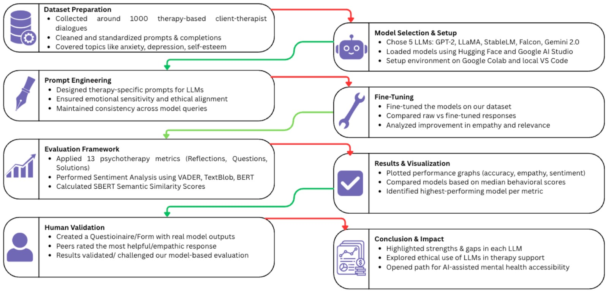
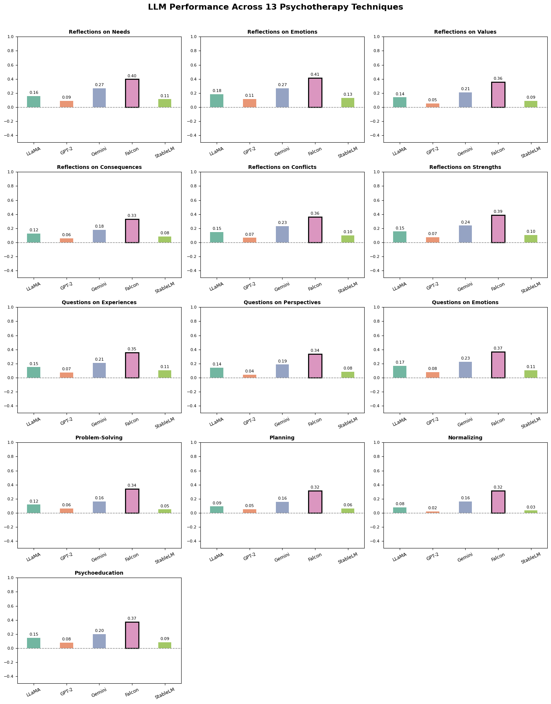
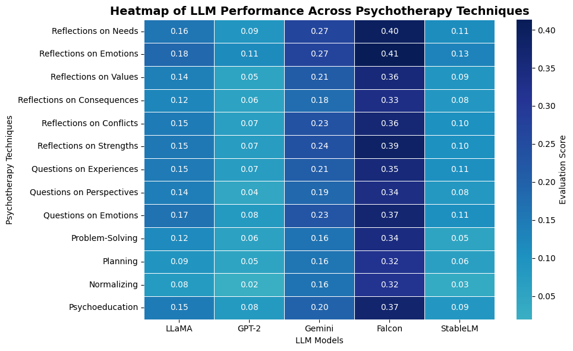
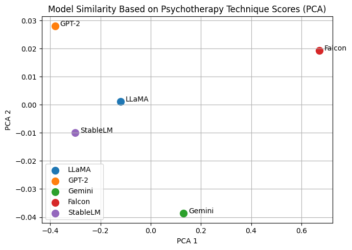
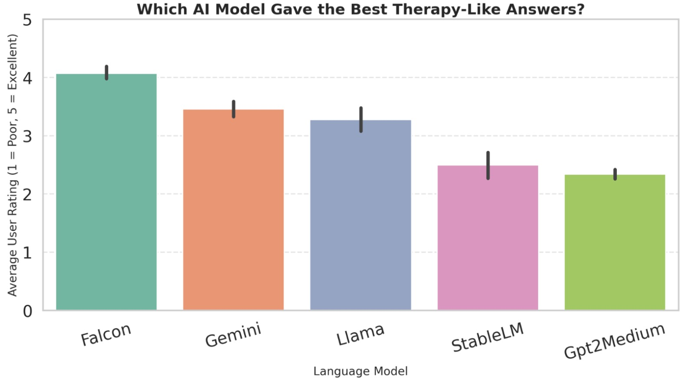

# 🧠 Machine Minds: Behavioral Assessment of LLM Therapists

---

## 📝 Abstract

Large Language Models (LLMs) are rapidly being explored for mental health support, but their reliability and safety remain uncertain.  
**Machine Minds** evaluates whether LLMs can engage in **therapeutic conversations**, using a custom dataset based on **13 psychotherapy techniques**.

We assess 5 leading models — **LLaMA**, **Falcon**, **GPT-2**, **StableLM**, and **Gemini** — across three critical axes:

- 🧠 **Semantic Similarity** (SBERT)
- 💬 **Sentiment Appropriateness** (VADER)
- 👥 **Human Validation** (Peer feedback)

---

## 🔁 Project Flow

<p align="center">
  
</p>

This flow diagram outlines the end-to-end pipeline of the project, from data curation to final evaluation:

1. **Dataset Creation**: We compiled a dataset of 600 simulated client prompts and therapist responses grounded in 13 psychotherapy techniques.
2. **Model Fine-Tuning**: Four open-source LLMs (LLaMA, Falcon, StableLM, GPT-2) were fine-tuned on the dataset, while Gemini was fine-tuned via Google AI Studio.
3. **Inference**: Each model generated therapeutic responses to the same set of client inputs.
4. **Evaluation**: Responses were assessed using:
   - **SBERT** for semantic alignment with ground truth
   - **VADER** for emotional appropriateness
   - **Peer Feedback** via a Google Form for human validation
5. **Visualization**: Results were synthesized into charts and diagrams to derive insights into model behavior and reliability in therapeutic contexts.


---

## 📊 Evaluation & Visual Insights

### 📌 1. Performance on 13 Psychotherapy Techniques

<p align="center">
  
</p>

This bar chart illustrates how each LLM performs across the 13 core psychotherapy techniques using two metrics: **SBERT semantic similarity** and **VADER sentiment alignment**.  
Key observations include:

- **Falcon** consistently achieves the highest semantic similarity across techniques like *Empathic Reflection* and *Cognitive Restructuring*, showing its ability to align well with therapeutic intent.
- **StableLM** excels in emotionally aligned responses, particularly in *Emotion Validation* and *Supportive Communication*, where sentiment tone is crucial.
- **LLaMA** offers steady performance across most techniques, reflecting a balanced but not outstanding output.
- **GPT-2**, while being an older model, shows surprisingly good results in a few structured techniques like *Psychoeducation*.
- **Gemini**, though a black-box model, performs well in specific categories but lacks fine-grained control due to closed architecture.

This technique-wise breakdown is essential for understanding which models are better suited for specific therapeutic strategies.


---

### 📌 2. Comparative Model Performance (Heatmap)

<p align="center">
  
</p>

The heatmap visualizes the average performance of each model across all 13 psychotherapy techniques, with darker shades representing better performance. Key insights include:

- **Falcon** consistently shows the highest performance across most techniques, particularly excelling in semantic alignment and user-relevant techniques like *Cognitive Behavioral Therapy (CBT)*.
- **StableLM** stands out in **Emotion Validation**, with its consistently positive sentiment responses, marked by a lighter color on the heatmap.
- **LLaMA** maintains a fairly balanced performance across all techniques, marked by moderate color shades, showing its adaptability to various therapeutic methods.
- **Gemini**, despite the lack of transparency in its fine-tuning process, performs well in specific techniques like *Solution-Focused Brief Therapy*, though the heatmap indicates areas of lesser performance in emotion-based techniques.
- **GPT-2** shows variance in performance, performing reasonably well in some techniques (like *Motivational Interviewing*), but lags behind other models in areas requiring deeper emotional resonance.

This heatmap allows for a quick comparison of model performance, highlighting areas where each model excels or requires improvement.

---

### 📌 3. Semantic Similarity of Responses (PCA)

<p align="center">
  
</p>

This PCA scatterplot projects model responses into a 2D space using SBERT embeddings, helping visualize how semantically similar the models are to each other.

- **Falcon** and **LLaMA** appear closer, suggesting similar semantic styles in response generation.
- **Gemini** is more distant, reflecting its unique response patterns.
- **StableLM** and **GPT-2** cluster separately, indicating distinctive yet somewhat related output behaviors.

This plot provides a bird’s-eye view of how closely aligned models are in their therapeutic language.
---

### 📌 4. Human Validation: Peer Ratings

<p align="center">
  
</p>

This chart shows average user ratings from peer feedback collected via a Google Form, where respondents evaluated model responses based on empathy, clarity, and usefulness.

- **Falcon** received the highest ratings, appreciated for its coherence and emotional resonance.
- **LLaMA** and **Gemini** followed closely, seen as consistent and structured in their replies.
- **GPT-2** and **StableLM** had the lowest ratings, often perceived as generic or outdated.

These insights reflect real-world perceptions and help validate automated evaluations with human judgment.

---

## 📈 Key Findings

| Evaluation Aspect           | Top Performing Model | Insight                                                                 |
|----------------------------|----------------------|-------------------------------------------------------------------------|
| 🔍 Semantic Accuracy        | **Falcon**           | Produced responses most similar to expert references (via SBERT)        |
| 💬 Emotional Appropriateness| **StableLM**         | Delivered the most sentiment-aligned and compassionate responses        |
| 👥 Human Preference         | **Gemini**           | Rated highest by users for empathy and clarity                          |
| ⚖️ Consistency Across Tasks | **LLaMA**            | Delivered balanced performance across all 13 psychotherapy techniques   |


---

## ⚠️ Limitations

- 🧪 *Simulated Data*: No real patient data was used due to ethical constraints.
- 🤖 *Model Bias*: Some models showed repetition or over-reassurance.
- 🧭 *Limited Gemini Reproducibility*: Gemini was fine-tuned in Google AI Studio (no code export).
- 💻 *Resource Constraints*: Larger models were tested within limited compute settings.

---

## 🚀 Future Work

- 🗣️ Use real anonymized therapist-patient conversations for robust testing.
- 🤝 Integrate newer open-source models like **Claude 3**, **Mixtral**, or **Command R+**.
- 💡 Introduce affective computing via emotion classifiers for deeper empathy evaluation.
- 🧬 Build a safe, real-time interface for AI-supported therapy.

---

## 📁 Repository Structure

```bash
llm-therapy-evaluation/
├── data/               # Fine-tuning and evaluation datasets
├── models/             # Model notebooks (LLaMA, Falcon, GPT-2, etc.)
├── evaluation/         # SBERT, VADER, PCA, Heatmap visualizations
├── presentation/       # Slides, poster, and competition materials
├── report/             # Final PDF report and LaTeX sources
├── requirements.txt    # Python dependency file
└── README.md           # This file
